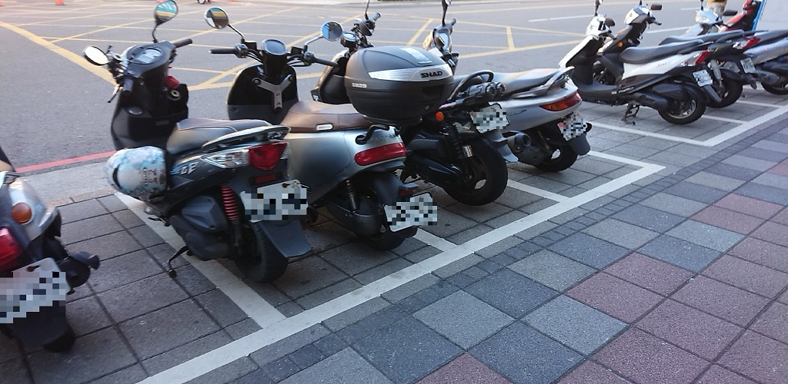

# license plate mask
- [x] Kotlin
- [x] Java
- [x] [CameraX](https://developer.android.com/training/camerax)
- [x] tflite

# Usage
- yolov5 to tflite example [here](https://github.com/zldrobit/yolov5)

# Installation:
- Install on Android Studio
- Put your `license_plate.tflite` model and `label.txt` in `assert` folder 
- Run

# Step:
- Take picture and wait a moment  
- The number will be pixelated on the lincense plate  
